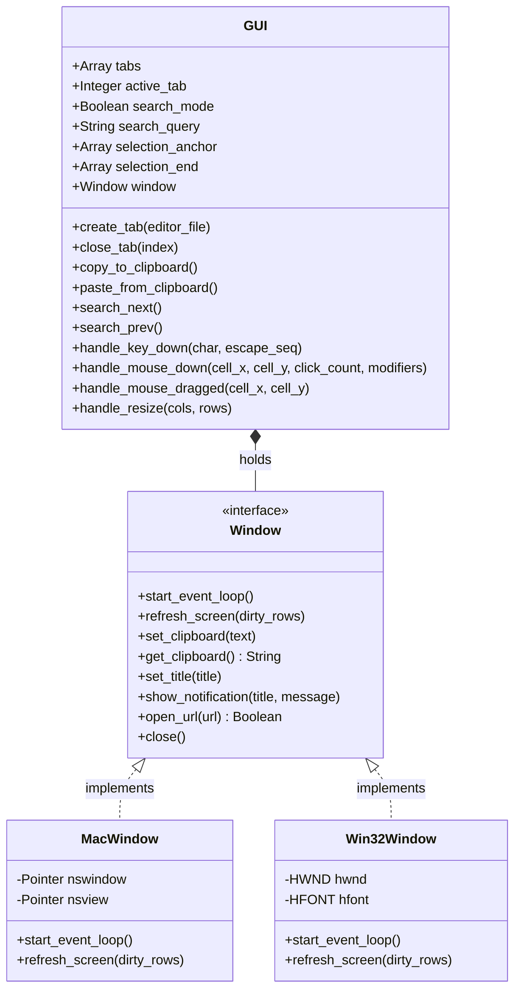

# GUI Backend Design Spec

作成日: 2026-05-22
著者: Antigravity AI
ステータス: 完了 (Completed) - 2026-05-23 時点でリファクタリング完了

## 1. 背景と目的

現在、`lib/echoes/gui.rb`（macOS/AppKit向け）は3,600行を超える巨大なモノリシッククラスとなっており、Cocoa/Objective-CのAPI呼び出し（Fiddle経由）と、タブやペインの構成、マウスのドラッグ選択範囲の計算、バッファ検索状態などの「OSに依存しないターミナル・オーケストレーション」が密結合しています。

Windows向けGUIである `lib/echoes/gui_win32.rb`（Win32/GDI向け）でも、これらのオーケストレーションが一部重複して実装されているか、あるいは未実装（ドラッグ選択、高度な検索など）の状態にあります。

この設計仕様書は、GUIバックエンドの責務を綺麗に分類し、**OS非依存の共通コア（オーケストレーター）** と **プラットフォーム固有のウィンドウコンポーネント** に分離（委譲パターンを採用）することで、コードの可読性、保守性、およびテストの容易性（Testability）を劇的に向上させるための設計を定義します。

---

## 2. アーキテクチャとクラス構成

リファクタリング後のGUIシステムは、OS非依存の `Echoes::GUI` クラスが中心となり、プラットフォーム固有の処理は `Echoes::GUI::Window` 契約に従う `MacWindow` または `Win32Window` に委譲されます。

### クラスダイアグラム (Mermaid)



---

## 3. ディレクトリ・ファイル構成

```
lib/echoes/
├── gui.rb                       # [変更] OS非依存のGUIオーケストレーター (共通)
└── gui/
    ├── mac_window.rb            # [新規] macOS/AppKit用 ウィンドウ・描画コンポーネント
    └── win32_window.rb          # [新規] Windows/GDI用 ウィンドウ・描画コンポーネント
```

---

## 4. API 契約（インターフェース）定義

### 4.1 GUI から Window への命令（要求）

`GUI` インスタンスは、`@window` に対して以下のメソッドを呼び出します。プラットフォーム固有のWindowクラスは、これらを完全に実装しなければなりません。

*   `start_event_loop`
    *   **説明**: ウィンドウを画面上に表示し、OS固有のメッセージループ（イベントループ）を開始します。このメソッドはアプリケーション終了までブロックします。
*   `refresh_screen(dirty_rows = nil)`
    *   **引数**: `dirty_rows` (更新が必要な行番号の範囲、あるいは単一のインデックス。nilの場合は全画面)
    *   **説明**: OSのウィンドウシステムに対し、再描画（Invalidate）を要求します。
*   `set_clipboard(text)`
    *   **引数**: `text` (クリップボードに設定する文字列)
    *   **説明**: OSのネイティブクリップボードにテキストを書き込みます。
*   `get_clipboard`
    *   **戻り値**: クリップボード内の文字列
    *   **説明**: OSのネイティブクリップボードからテキストを取得します。
*   `set_title(title)`
    *   **引数**: `title` (ウィンドウのタイトルバーに設定する文字列)
    *   **説明**: ネイティブウィンドウのタイトルを更新します。
*   `show_notification(title, message)`
    *   **説明**: OSの通知機能（メッセージボックスや通知センター）を用いてデスクトップ通知を表示します。
*   `open_url(url)`
    *   **説明**: `http` / `https` などのURLを、OSの既定ブラウザで開きます。
*   `close`
    *   **説明**: ネイティブウィンドウを破棄し、イベントループを終了させてウィンドウを閉じます。

### 4.2 Window から GUI へのイベント通知（コールバック）

`Window` インスタンスは、OSのウィンドウプロシージャ等でイベントを捕捉した際、自身が参照を保持する `GUI`（`@gui`）の以下のメソッドを呼び出します。

*   `handle_key_down(char, escape_seq = nil)`
    *   **説明**: キー入力イベントをGUIに渡します。通常の文字入力は `char`、エスケープシーケンスや特殊キーは `escape_seq` を渡します。
*   `handle_mouse_down(cell_x, cell_y, click_count, modifiers)`
    *   **説明**: グリッドのセル座標 `(cell_x, cell_y)` でのマウスクリックを通知します。`click_count`（ダブルクリック等）および修飾キー情報を含めます。
*   `handle_mouse_dragged(cell_x, cell_y)`
    *   **説明**: マウスがドラッグされていることをセル座標で通知します。選択範囲の拡張処理をトリガーします。
*   `handle_mouse_up`
    *   **説明**: マウスボタンが離されたことを通知します。
*   `handle_resize(cols, rows)`
    *   **説明**: ウィンドウのリサイズによりグリッドの行数・列数が変更されたことを通知します。アクティブタブの `resize` をトリガーします。
*   `handle_focus_changed(focused)`
    *   **説明**: ウィンドウのフォーカス獲得（Activate）または喪失（Deactivate）を通知します。カーソル点滅タイマーの制御や境界線のハイライト変更に使用されます。
*   `handle_ime_composition(marked_text)`
    *   **説明**: IMEの入力中（未確定）テキストを通知します。画面上のインライン描画用バッファ（`@marked_text`）を更新します。

---

## 5. 段階的リファクタリング計画

移行時の動作破壊を防ぐため、以下の手順で段階的にリファクタリングを実行します。

1.  **段階 1: ディレクトリとファイルの準備**
    *   空の `lib/echoes/gui/mac_window.rb` と `lib/echoes/gui/win32_window.rb` を作成します。
2.  **段階 2: macOS版 `gui.rb` の分離（最難関）**
    *   `gui.rb` の中の `ObjC` 関連呼び出し、イベントループ、フォント測定・描画処理（`draw_rect` など）を `gui/mac_window.rb` に移行します。
    *   `gui.rb` 自体はOS非依存のオーケストレーターとして、状態管理（タブ、ペイン、選択範囲、検索）のみを残します。
    *   この段階で、macOS上で動作が変わらないことを手動および既存のテストで検証します。
3.  **段階 3: Windows版 `gui_win32.rb` の分離**
    *   `gui_win32.rb` の中の Win32 API 呼び出し、メッセージループ、GDI 描画処理を `gui/win32_window.rb` に移行します。
    *   `gui_win32.rb` 自体は不要となるため削除（`[DELETE]`）し、Windows 環境でも `lib/echoes/gui.rb`（共通）が使用されるように `lib/echoes.rb` を修正します。
4.  **段階 4: 共通インターフェースの統合とクリーンアップ**
    *   両OS共通となった `Echoes::GUI` 内で、これまで Windows 版になかった「高度な検索機能」や「マウスドラッグ選択」が Windows でも機能するようイベント通知を統合します。

---

## 6. 検証計画

### 6.1 自動テストの実行
各段階の完了ごとに、OS非依存のコアテストスイートが正常にパスすることを確認します。

*   **Windows での確認**:
    ```powershell
    ruby -S rake test:core
    ```
    (600個以上のテストケースがすべて通過することを確認)

*   **macOS での確認** (macOS環境での最終確認時に実行):
    ```bash
    bundle exec rake test
    ```

### 6.2 手動動作確認（Windows）
リファクタリング後、Windows上でGUIが正しく動作することを確認します。

*   **確認手順**:
    1.  `ruby exe/echoes` を起動して GUI ウィンドウが表示されること。
    2.  シェル（cmd.exe / PowerShell）でコマンドを入力・実行できること。
    3.  ウィンドウのサイズ変更時に、行数・列数が正しく追従し、崩れないこと。
    4.  `Ctrl+Shift+C` / `Ctrl+Shift+V` によるコピペが正常に機能すること。
    5.  新たに有効化されたマウスドラッグによるテキスト選択機能が動作すること。
